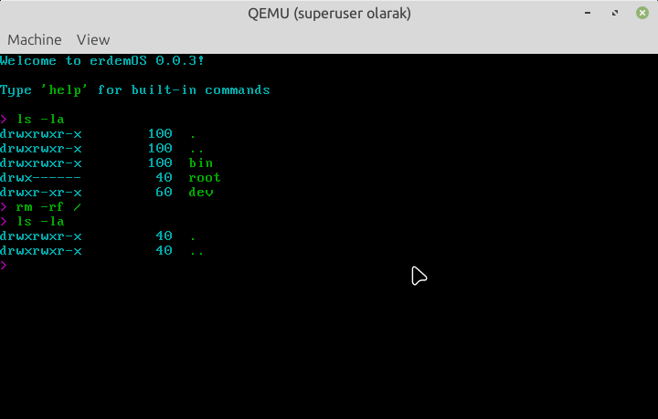

# erdemOS
Simple Linux userspace environment with a custom init system and shell (ersh) that boots with the host system's Linux kernel in QEMU.



## Features
- **Custom init system** - Minimal init process with proper signal handling
- **ersh (Erdem Shell)** - Custom shell with built-in commands
- **Colorized output** - ANSI color support with erdemOS color scheme
- **Power management** - Integrated poweroff command
- **Static binaries** - Self-contained executables with no dependencies

## Requirements
- gcc (with static linking support)
- qemu-system-x86_64
- Linux kernel (available at /boot/vmlinuz-*)
- cpio, gzip

On Debian/Ubuntu: `sudo apt-get install build-essential qemu-system-x86 cpio gzip`

## Build and run
```bash
./build.sh   # Compiles init, ersh, and poweroff; creates initramfs
./run.sh     # Boots with host kernel in QEMU
./clean.sh   # Removes build artifacts
```

## ersh - Erdem Shell
The custom shell includes the following built-in commands:
- `cd <dir>` - Change directory
- `exit` - Exit shell (returns to init)
- `help [command]` - Show built-in commands or detailed help for a specific command
- `kbd <layout>` - Change keyboard layout (trq for Turkish Q, trf for Turkish F, en for English)
- `license` - Show license (displays copyright and Apache License 2.0 information)
- `ls [-al] [dir]` - List directory contents (supports -a for all files, -l for long format)
- `mkdir <dir>` - Create directory
- `poweroff` - Exit shell and power off the system
- `pwd` - Print working directory
- `rm [-rf] <file/dir>` - Remove file or directory (supports -r/-R for recursive, -f for force)
- `touch <file>` - Create empty file
- `ver` - Show version (displays "erdemOS" and version number)

External commands can also be executed if available in the initramfs.

## How it works
- Compiles static binaries for init, ersh shell, poweroff utility, and loadkeys utility
- Creates a minimal initramfs containing all binaries in `/bin/`
- Boots QEMU with the host's Linux kernel and the custom initramfs
- The kernel executes `/bin/init` which launches `/bin/ersh`
- The shell provides an interactive command-line interface
- Uses ANSI escape codes for colorized terminal output
- Custom loadkeys utility supports Turkish Q, Turkish F, and English layouts

## Files
- `src/init.c` - Init process with signal handling and shell launching
- `src/ersh.c` - Custom shell with built-in commands
- `src/poweroff.c` - Power off utility using Linux reboot syscall
- `src/loadkeys.c` - Keyboard layout loader utility
- `include/colors.h` - ANSI color definitions for erdemOS
- `include/version.h` - Version definitions generated from VERSION file
- `VERSION` - Project version number (currently 0.0.3)
- `build.sh` - Compiles all programs and creates initramfs
- `run.sh` - Launches QEMU with the host kernel
- `clean.sh` - Removes build artifacts

## Color Scheme
erdemOS uses ANSI escape codes with the following color scheme:
- **Cyan** - Primary color for normal text and titles
- **Magenta** - Shell prompt
- **Green** - Command names
- **Blue** - Informational headers
- **Yellow** - Warnings
- **Red** - Errors

## Copyright and License
Copyright (c) 2025 Erdem Ersoy (eersoy93)

Licensed with Apache License 2.0

Used with GitHub Copilot.
