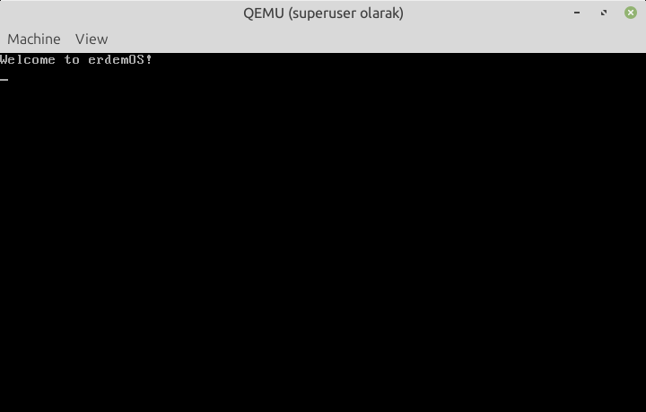

# erdemOS
Simple Linux userspace init program that boots with the host system's Linux kernel in QEMU.



## Requirements
- gcc (with static linking support)
- qemu-system-x86_64
- Linux kernel (available at /boot/vmlinuz-*)
- cpio, gzip

On Debian/Ubuntu: `sudo apt-get install build-essential qemu-system-x86 cpio gzip`

## Build and run
```bash
./build.sh   # Compiles init program and creates initramfs
./run.sh     # Boots with host kernel in QEMU
```

The program clears the screen and prints "Hello from Linux!" using system calls only.

## How it works
- Compiles a static binary (`init.c`) that serves as the init process
- Creates a minimal initramfs containing the init binary
- Boots QEMU with the host's Linux kernel and the custom initramfs
- The kernel executes `/bin/init` from the initramfs

## Files
- `src/init.c` - The init program source code
- `build.sh` - Compiles the program and creates initramfs
- `run.sh` - Launches QEMU with the host kernel
- `clean.sh` - Removes build artifacts

## Copyright and License
Copyright (c) 2025 Erdem Ersoy (eersoy93)

Licensed with Apache License 2.0

Used with GitHub Copilot.
